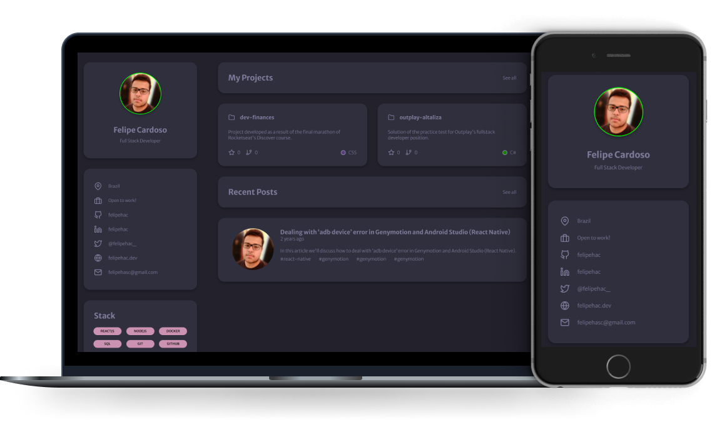

<h1 align="center">
  Felipe Cardoso - Portfólio
</h1>

  <a href="#-tecnologias">Tecnologias</a> | <a href="#-projeto">Projeto</a> | <a href="#-layout">Layout</a> | <a href="#-licença">Licença</a>

  

<a href="https://felipehac.github.io/rs-portfolio/">

  

<strong>VER DEMO</strong>

</a>

## 🚀 Tecnologias

Esse projeto foi desenvolvido com as seguintes tecnologias:

- HTML
- CSS
- JavaScript

## 💻 Projeto

O projeto foi desenvolvido como forma de consolidar os conhecimentos obtidos por meio do curso Discover da Rocketseat.

O projeto foi desenvolvido em HTML, CSS e JavaScript e consome a API do GitHub para popular os repositórios da página.

## 🔖 Layout

Você pode visualizar o layout do projeto através [desse link](https://www.figma.com/file/L6fCiWtOgXCfslQdezqQeF/DD-Portfolio). É necessário ter conta no [Figma](https://figma.com) para acessá-lo.

## 📝 Licença

Esse projeto está sob a licença MIT. Veja o arquivo [LICENSE](LICENSE.md) para mais detalhes.

---
